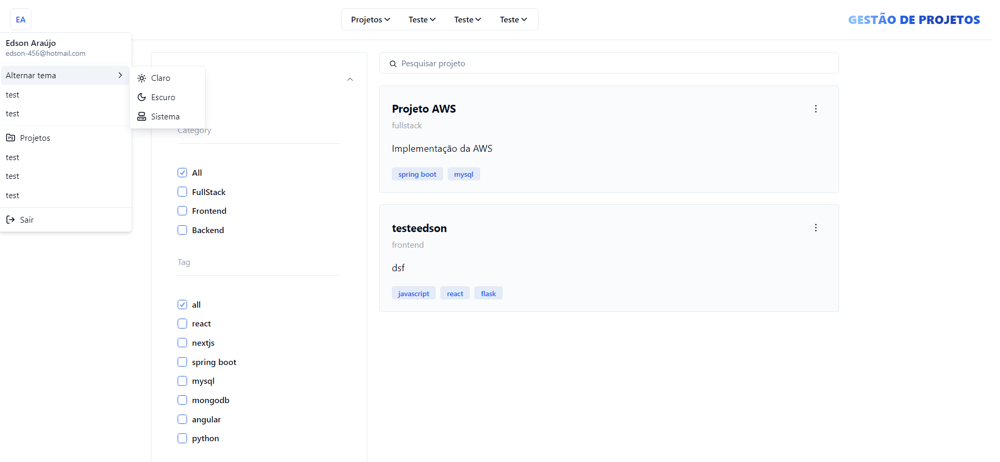
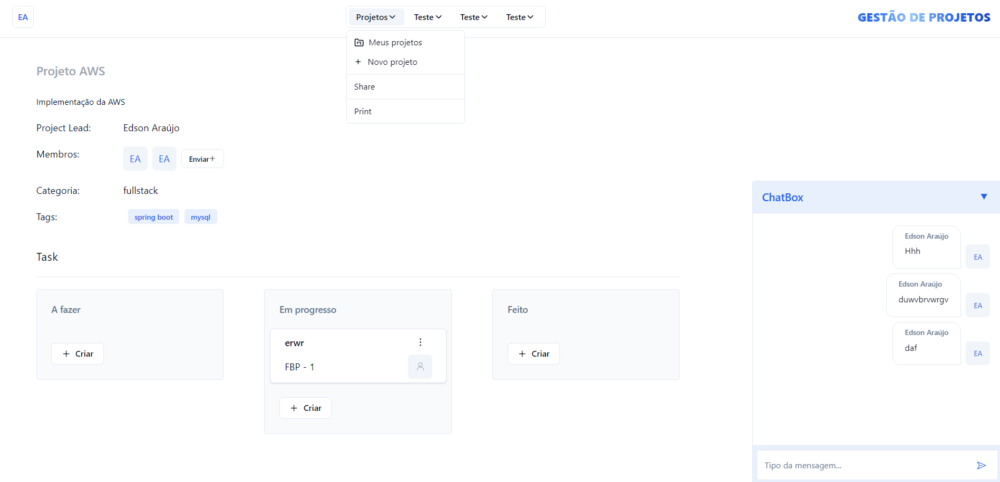
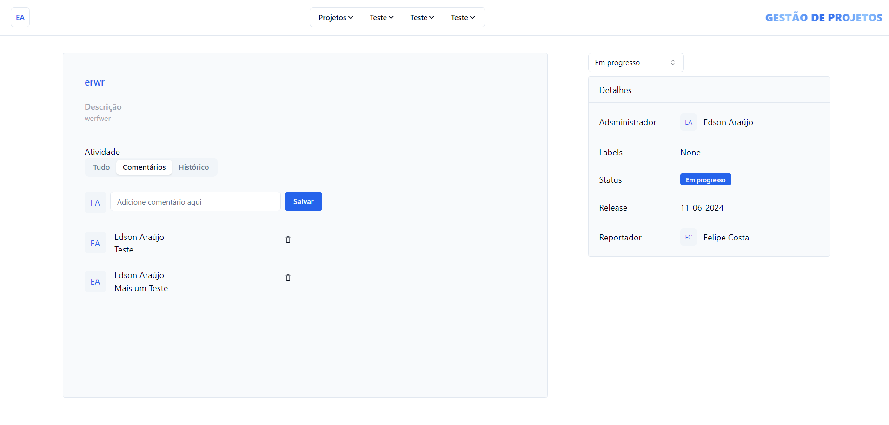

# Management System

[](https://github.com/prettier/prettier)

**Access:** [Acesse aqui](http://systemmanagementedson.s3-website.us-east-2.amazonaws.com/)

## Introduction

Welcome to my portfolio! This system was created to showcase my projects, skills, and experiences. I developed this project using modern technologies such as AWS, Spring, Tailwind CSS, and React. The goal is to provide a clear and professional vision for project management.

## Technologies Used

- **Spring**: A comprehensive framework for building Java applications.
- **Tailwind CSS**: A utility-first CSS framework for rapid UI development.
- **React**: A JavaScript library for building user interfaces.
- **AWS**: A cloud platform providing various services for hosting and managing applications.

## Features

- **Dark/Light Theme**: Implementation of dark and light themes with easy switching.
- **Responsive Design**: Layout adaptable to different screen sizes, ensuring a good experience on both mobile devices and desktops.
- **Intuitive Navigation**: Clear and organized structure to facilitate navigation between sections of the site.
- **Project Management Tools**: Tools and features designed specifically for managing projects effectively.

## Getting Started

### Prerequisites

- **Node.js**: Make sure you have Node.js installed on your machine. You can download it [here](https://nodejs.org/).
- **Java**: Ensure you have the Java Development Kit (JDK) installed. You can download it [here](https://www.oracle.com/java/technologies/javase-jdk11-downloads.html).

### Installation

1. Clone the repository:
    ```bash
    git clone https://github.com/edson-araujo/systemManagement-frontend
    ```

2. Navigate to the project directory:
    ```bash
    cd systemManagement-frontend
    ```

3. Install the dependencies for the frontend:
    ```bash
    npm install
    ```

### Running the Project
1. Start the frontend development server:
    ```bash
    npm run dev
    ```

### Screenshots



